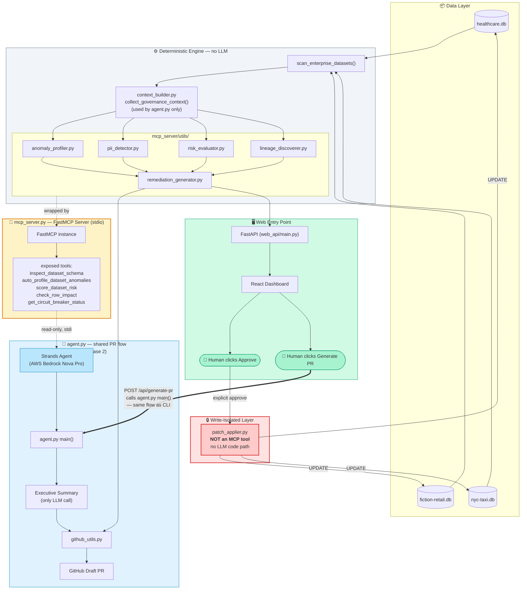

# Albugent v2.0 — Autonomous Data Governance Agent

Albugent is an autonomous AI agent that audits SQLite datasets for data quality issues and PII, reasons over the findings using its own judgment, and ships the result as a ready-to-review GitHub Pull Request — plus a live web dashboard for human-in-the-loop review and one-click remediation.

Built with the [Strands Agents SDK](https://strandsagents.com) on AWS Bedrock.

---

## The Problem

Data catalogs (e.g. DataHub) excel at **detection** — surfacing schema, lineage, and quality signals. But closing the gap between detection and safe, reviewed remediation still falls to a human: someone still has to write the fix, get it reviewed, and ship it. Albugent automates that gap without removing the human from the loop — every fix is generated by a deterministic engine, never by the LLM directly, and nothing is written back to production data until a person explicitly approves it.

It's built for teams without the resources to run a full catalog deployment, and for teams that already run one but need a safe automation layer on top.

---

## What's New in v2.0

The original CLI-only agent (scan → SQL → PR) is still fully intact and working. v2.0 adds a full web layer on top:

- **FastAPI backend** (`web_api/main.py`) exposing dashboard data and remediation actions over HTTP
- **React + Vite + Tailwind frontend** (`web-ui/`) — a live governance dashboard with:
  - KPI banner (data assets, tables scanned, PII columns, policy violations)
  - Per-domain downstream lineage map
  - Pending Proposals queue with one-click **Approve** / **Reject**
  - Data Quality Insights and PII Distribution (severity-classified)
  - Live Metrics chart tracking KPI movement over the session
  - Activity Log with a history of approve/reject actions
  - "Generate PR" button that triggers the same agentic Phase 2 flow from the browser
- **Independent remediation patches** — anomalies are no longer bundled into one SQL blob per table; each is a separately identified, separately applicable `RemediationPatch`
- **Write-path isolation** — the function that actually applies a patch (`patch_applier.py`) is a plain Python function, *not* an MCP tool. The LLM/agent has no access to it under any circumstance; only an explicit human action (an API call triggered by clicking Approve) can invoke it
- **`check_row_impact` tool** — generic cross-table impact analysis using existing lineage discovery, with an explicit `join_confidence` flag (`exact_key_match` vs `pii_name_match`)

---

## How It Works

Albugent has two independent entry points into the same underlying logic.

### Entry point A — CLI agent (`agent.py`), full agentic PR flow

**Phase 1 — Deterministic Context & SQL Generation (no LLM)**
1. `scan_enterprise_datasets()` scans `data/<domain>/*.db` and builds a registry of every table, keyed by a DataHub-style URN.
2. Pure-Python profilers run: null-rate analysis, numeric range checks, date-logic inversion checks (role-aware — see below), PII column detection, and lineage-aware risk scoring.
3. `generate_remediation_sql()` turns every detected anomaly into a safe, deterministic SQL fix.

This half never touches an LLM. The SQL in the PR is 100% reproducible from the data.

**Phase 2 — Agentic Investigation & Report (Strands + Bedrock)**
1. A Strands `Agent`, backed by Amazon Bedrock (Nova Pro), connects to the MCP server over stdio with a limited, read-only toolset.
2. The agent decides for itself how to investigate each dataset — order and reasoning are its own, not scripted.
3. The agent composes a consolidated governance report, built deterministically in Python from tool outputs — **not** generated by the LLM. The only LLM call in this phase writes a 3–4 sentence executive summary, with no tool access.
4. The agent never writes remediation SQL itself.

**Phase 3 — PR Delivery**
The SQL artifact and the report are combined into a Draft PR via the GitHub API.

### Entry point B — Web dashboard (`web_api/` + `web-ui/`), human-in-the-loop review

1. FastAPI imports the same `mcp_server/utils/*` functions directly as Python — no LLM involved in this path at all.
2. `/api/proposals` calls `generate_remediation_patches()` per dataset, returning one `RemediationPatch` per detected anomaly.
3. A person reviews each patch in the browser and clicks **Approve** or **Reject**.
4. Approve calls `patch_applier.apply_patch()` directly — a plain Python function, never exposed as an MCP tool.
5. The **Generate PR** button in the dashboard triggers the same Phase 1 + Phase 2 flow as the CLI agent, via `/api/generate-pr`.

Both entry points read and write the same `.db` files in `data/`. Anomalies fixed through the dashboard will no longer appear next time the CLI agent runs, and vice versa.

---

## Architecture



---

## Repository Structure

```
albugent_v2.0/
├── docker-compose.yml
├── agent/
│   ├── agent.py                    # entrypoint — Phase 1 + Phase 2 orchestration
│   ├── dockerfile
│   ├── requirements.txt
│   └── prompts/
│       └── system_prompts.py       # GOVERNANCE_SYSTEM_PROMPT
├── context_builder/
│   └── context_builder.py          # deterministic per-dataset aggregation
├── mcp_server/
│   ├── mcp_server.py               # FastMCP server + tool definitions
│   ├── dockerfile
│   ├── requirements.txt
│   └── utils/
│       ├── db_utils.py
│       ├── github_utils.py
│       ├── graph_engine.py
│       ├── lineage_discoverer.py
│       ├── pii_detector.py
│       ├── anomaly_profiler.py
│       ├── risk_evaluator.py
│       ├── remediation_generator.py
│       └── patch_applier.py        # apply_patch — write-only, NOT an MCP tool
├── web_api/
│   ├── main.py
│   ├── dockerfile
│   └── requirements.txt
├── web-ui/
│   ├── Dockerfile
│   └── src/
│       ├── App.tsx
│       └── index.css
└── data/
    ├── healthcare/
    ├── fiction-retail/
    └── nyc-taxi/
```

---

## Datasets

| Domain | Pattern | What it tests |
|---|---|---|
| `healthcare` | Forking pipeline (raw → staging → 2 marts) | Selective quality propagation |
| `fiction-retail` | 10-table e-commerce schema | PII detection breadth, legitimate vs. erroneous NULLs |
| `nyc-taxi` | 3-stage pipeline (`nyc_taxi_pipeline.db`) | Freshness/staleness detection, coordinate data handling |

> **Demo data note:** the databases committed to this repo include pre-seeded data quality issues for evaluation. Approving remediation proposals resolves these issues in place, in the actual `.db` files. To get a fresh, "dirty" copy again, re-clone the repository.

---

## Setup

### Prerequisites

**To run via Docker (recommended):**
- Docker and Docker Compose

**To run manually, without Docker:**
- Python 3.11+
- Node.js 18+

**In both cases:**
- An AWS account with Bedrock model access (Nova Pro or your chosen model)
- A GitHub Personal Access Token with `repo` scope

### Environment Variables

Create a `.env` file in the project root:

```bash
AWS_ACCESS_KEY_ID=your_access_key
AWS_SECRET_ACCESS_KEY=your_secret_key
AWS_REGION=us-east-1
AWS_BEDROCK_MODEL_ID=amazon.nova-pro-v1:0
GH_TOKEN=your_github_personal_access_token
GITHUB_REPOSITORY=your-username/your-repo
```

### Run via Docker (Windows / macOS / Linux — identical)

```bash
docker compose up --build web-api web-ui
```

This starts:
- **FastAPI backend** on `http://localhost:8000`
- **React dashboard** on `http://localhost:5173`

Open `http://localhost:5173` in your browser.

To run the CLI agent (full agentic PR flow, independent of the dashboard):

```bash
docker compose run --build --rm strands-agent
```

The same flow is also available from the dashboard via the **Generate PR** button.

### Run manually, without Docker

**macOS / Linux:**

```bash
# Backend
python3 -m venv .venv
source .venv/bin/activate
python -m pip install --upgrade pip
pip install -r agent/requirements.txt
pip install -r web_api/requirements.txt
python -m uvicorn web_api.main:app --port 8000
```

**Windows (PowerShell):**

```powershell
# Backend
python -m venv .venv
.venv\Scripts\Activate.ps1
python -m pip install --upgrade pip
pip install -r agent/requirements.txt
pip install -r web_api/requirements.txt
python -m uvicorn web_api.main:app --port 8000
```

**Frontend (same on every platform, separate terminal):**

```bash
cd web-ui
npm install
npm run dev
```

Open the printed local URL (typically `http://localhost:5173`). The dashboard fetches from `http://localhost:8000` — keep the backend running.

To run the CLI agent manually (without Docker):

```bash
python agent/agent.py
```

---

## API Reference (`web_api/main.py`)

| Endpoint | Method | Purpose |
|---|---|---|
| `/api/kpi-summary` | GET | Data assets, tables scanned, PII column count, policy violations |
| `/api/proposals` | GET | All pending remediation patches across every dataset |
| `/api/proposals/{patch_id}/approve` | POST | Applies the patch directly to the SQLite file |
| `/api/proposals/{patch_id}/reject` | POST | Dismisses the patch from the queue |
| `/api/pii-distribution` | GET | PII columns bucketed by severity |
| `/api/quality-insights` | GET | Top anomalies ranked by affected-row percentage |
| `/api/lineage-graph` | GET | Nodes and edges for the dashboard's lineage map |
| `/api/generate-pr` | POST | Triggers the full CLI agent flow, returns `{status, pr_url}` |
| `/api/activity-log` | GET | History of approve/reject actions |

---

## MCP Tools

| Tool | Purpose |
|---|---|
| `list_available_datasets` | Returns all registered dataset URNs |
| `inspect_dataset_schema` | Columns, tags, and detected PII fields |
| `auto_profile_dataset_anomalies` | Full anomaly profile + downstream lineage impact |
| `score_dataset_risk` | Combined risk score |
| `score_all_datasets_risk` | Aggregated risk across the whole registry |
| `check_row_impact` | Cross-table impact analysis, flags `join_confidence` |
| `get_circuit_breaker_status` | HALTED / MONITOR / OK status, with triggering anomaly |
| `get_remediation_patches` | Independent remediation patches for a dataset |
| `execute_sql_query` | Read-only (`SELECT`/`PRAGMA`) |
| `calculate_pipeline_centrality` | Betweenness centrality across the lineage graph |
| `get_dataset_sample` | Sample rows for manual inspection |

**Write operations are never exposed as MCP tools.** `patch_applier.apply_patch()` is called only from `web_api/main.py`'s approve endpoint, in direct response to an explicit human action.

---

## Anomaly Detection Approach

- **Numeric anomalies**: negative-value checks, with an explicit exclusion for columns where negative values are legitimate (e.g. geographic longitude)
- **Date-logic anomalies**: role-aware pairing — a column must match a `START_KEYWORDS` or `END_KEYWORDS` term to be paired at all
- **NULL-rate classification**: a 20% threshold distinguishes likely data-entry errors from nullable-by-design fields
- **PII detection**: keyword-based column matching, with a severity classification layered on top

---

## Known Limitations

- **Circuit breaker logic is partially implemented.** It computes and surfaces a status (HALTED/MONITOR/OK) per dataset, but is not wired into a system that actually halts downstream processing — that would require a dedicated ETL orchestrator (e.g. Airflow), which is not part of this project.
- **No automated test suite yet.**
- **PII detection is keyword-based, not NLP/ML-based.**
- **No dataset-registry caching** — every API call re-profiles data directly from disk.
- **Live Metrics chart resets on page reload.**
- **A migration to Amazon Bedrock AgentCore was attempted** (see the separate `AlbugentAgentcore` repository) — the MCP server was successfully adapted to AgentCore's Runtime/Gateway model. The full migration was not completed and is left as future work.

---

## Roadmap

- [ ] Verifier/critic agent pattern for the Phase 2 report
- [ ] Full selective circuit-breaker implementation
- [ ] Production deployment via Amazon Bedrock AgentCore Runtime
- [ ] Amazon Bedrock Guardrails integration

---

## Tech Stack

- **Agent framework**: Strands Agents SDK (Apache 2.0)
- **Model**: Amazon Bedrock (Nova Pro)
- **Tool protocol**: MCP, via FastMCP
- **Backend**: FastAPI
- **Frontend**: React, Vite, Tailwind CSS v4, Recharts
- **Data layer**: SQLite
- **Lineage graph**: NetworkX
- **PR automation**: PyGithub

---

## AI Assistance Disclosure

Portions of this codebase were written with AI coding assistance (Claude, and Kiro for the AgentCore migration attempt) during the submission period. All architectural decisions, data, and testing were directed and reviewed by the author.

---

### 📄 License

This project is licensed under the Apache-2.0 License — see the LICENSE file for details.
